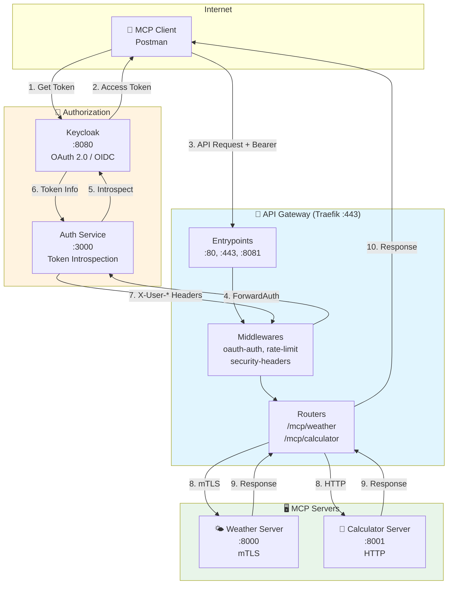

# 🏗️ MCP Gateway - Architecture

## Vue d'ensemble

```
┌─────────────────────────────────────────────────────────────────────────────────────┐
│                                    INTERNET                                          │
└─────────────────────────────────────────────────────────────────────────────────────┘
                                          │
                                          ▼
┌─────────────────────────────────────────────────────────────────────────────────────┐
│                              👤 MCP CLIENT (Postman)                                 │
│                                                                                      │
│  1️⃣ Demande un token OAuth ──────────────────────────────────────────────────┐      │
│  2️⃣ Appelle /mcp/weather ou /mcp/calculator avec Bearer token                │      │
└──────────────────────────────────────────────────────────────────────────────│──────┘
                    │                                                          │
                    │ HTTPS :443                                               │ HTTP :8080
                    ▼                                                          ▼
┌─────────────────────────────────────────────────┐    ┌──────────────────────────────┐
│           🚪 API GATEWAY (Traefik)              │    │   🔐 AUTHORIZATION SERVER    │
│                  :443                            │    │       (Keycloak)             │
│                                                  │    │          :8080               │
│  ┌────────────────────────────────────────────┐ │    │                              │
│  │           ENTRYPOINTS                       │ │    │  • OAuth 2.0 / OIDC         │
│  │  • :80 (HTTP → HTTPS redirect)             │ │    │  • Token endpoint           │
│  │  • :443 (HTTPS - TLS termination)          │ │    │  • Introspection endpoint   │
│  │  • :8081 (Dashboard)                       │ │    │  • JWKS endpoint            │
│  └────────────────────────────────────────────┘ │    │                              │
│                      │                          │    │  Realm: mcp-gateway          │
│                      ▼                          │    │  Clients:                    │
│  ┌────────────────────────────────────────────┐ │    │   • mcp-client (public)     │
│  │           MIDDLEWARES                       │ │    │   • api-gateway (confid.)  │
│  │                                             │ │    └──────────────────────────────┘
│  │  1. oauth-auth (ForwardAuth) ──────────────┼─┼──────────────┐
│  │  2. rate-limit (100 req/min)               │ │              │
│  │  3. security-headers (XSS, HSTS...)        │ │              ▼
│  │  4. strip-prefix (/mcp/weather → /)        │ │    ┌──────────────────────────────┐
│  └────────────────────────────────────────────┘ │    │    🛡️ AUTH SERVICE (Flask)   │
│                      │                          │    │          :3000               │
│                      ▼                          │    │                              │
│  ┌────────────────────────────────────────────┐ │    │  /verify                     │
│  │           ROUTERS                           │ │    │   • Extrait Bearer token    │
│  │                                             │ │    │   • Appelle Keycloak        │
│  │  /mcp/weather    → mcp-weather-service     │ │    │     introspection           │
│  │  /mcp/calculator → mcp-calculator-service  │ │    │   • Retourne headers:       │
│  │  /health         → health-service          │ │    │     X-User-Sub              │
│  │  /.well-known/*  → oauth-discovery-service │ │    │     X-User-Email            │
│  └────────────────────────────────────────────┘ │    │     X-User-Scopes           │
│                      │                          │    │                              │
│                      │                          │    │  401 + WWW-Authenticate     │
│                      │                          │    │  si token invalide          │
└──────────────────────┼──────────────────────────┘    └──────────────────────────────┘
                       │
          ┌────────────┴────────────┐
          │                         │
          ▼ mTLS (HTTPS)            ▼ HTTP
┌─────────────────────────┐  ┌─────────────────────────┐
│  🌤️ MCP WEATHER SERVER  │  │  🧮 MCP CALCULATOR      │
│        :8000             │  │        :8001            │
│                          │  │                         │
│  Protocol: JSON-RPC 2.0  │  │  Protocol: JSON-RPC 2.0 │
│  Transport: HTTPS/mTLS   │  │  Transport: HTTP        │
│                          │  │                         │
│  Tools:                  │  │  Tools:                 │
│  • get_weather_forecast  │  │  • add                  │
│  • get_weather_alerts    │  │  • subtract             │
│  • get_uv_index          │  │  • multiply             │
│                          │  │  • divide               │
│  Vérifie X-User-Scopes   │  │  • power                │
│  pour autorisation       │  │  • sqrt                 │
└─────────────────────────┘  └─────────────────────────┘
```

## 🔄 Flux OAuth 2.0 Complet

```
┌──────────┐     ┌──────────┐     ┌──────────┐     ┌──────────┐     ┌──────────┐
│  Client  │     │ Traefik  │     │  Auth    │     │ Keycloak │     │   MCP    │
│ (Postman)│     │ Gateway  │     │ Service  │     │          │     │  Server  │
└────┬─────┘     └────┬─────┘     └────┬─────┘     └────┬─────┘     └────┬─────┘
     │                │                │                │                │
     │ 1. POST /token │                │                │                │
     │ (grant_type=   │                │                │                │
     │  authorization_code)            │                │                │
     │────────────────────────────────────────────────▶│                │
     │                │                │                │                │
     │ 2. access_token│                │                │                │
     │◀────────────────────────────────────────────────│                │
     │                │                │                │                │
     │ 3. POST /mcp/weather            │                │                │
     │    Authorization: Bearer xxx    │                │                │
     │───────────────▶│                │                │                │
     │                │                │                │                │
     │                │ 4. ForwardAuth │                │                │
     │                │    /verify     │                │                │
     │                │───────────────▶│                │                │
     │                │                │                │                │
     │                │                │ 5. POST        │                │
     │                │                │    /introspect │                │
     │                │                │───────────────▶│                │
     │                │                │                │                │
     │                │                │ 6. {active:    │                │
     │                │                │     true, ...} │                │
     │                │                │◀───────────────│                │
     │                │                │                │                │
     │                │ 7. 200 OK      │                │                │
     │                │    X-User-Sub  │                │                │
     │                │    X-User-Scopes                │                │
     │                │◀───────────────│                │                │
     │                │                │                │                │
     │                │ 8. POST / (mTLS)                │                │
     │                │    + X-User-* headers           │                │
     │                │────────────────────────────────────────────────▶│
     │                │                │                │                │
     │                │ 9. JSON-RPC Response            │                │
     │                │◀────────────────────────────────────────────────│
     │                │                │                │                │
     │ 10. Response   │                │                │                │
     │◀───────────────│                │                │                │
     │                │                │                │                │
```

## 🔐 mTLS (Mutual TLS) - Détail

```
┌─────────────────────────────────────────────────────────────────────────────┐
│                              CERTIFICATS                                     │
│                                                                              │
│  ┌─────────────────┐                                                        │
│  │   🏛️ CA (Root)   │  ca.crt / ca.key                                      │
│  │   MCP-Gateway-CA │  Auto-signé, fait confiance à tous                    │
│  └────────┬────────┘                                                        │
│           │                                                                  │
│           │ Signe                                                           │
│           ▼                                                                  │
│  ┌─────────────────────────────────────────────────────────────────┐        │
│  │                                                                  │        │
│  │  ┌─────────────────────┐         ┌─────────────────────┐        │        │
│  │  │ 🚪 gateway.crt/key   │         │ 🌤️ mcp-weather.crt  │        │        │
│  │  │                      │         │    /key             │        │        │
│  │  │ CN=gateway           │         │ CN=mcp-weather      │        │        │
│  │  │ SAN: localhost,      │         │ SAN: mcp-weather,   │        │        │
│  │  │      traefik         │         │      localhost      │        │        │
│  │  │                      │         │                     │        │        │
│  │  │ Utilisé par Traefik  │         │ Utilisé par MCP     │        │        │
│  │  │ comme CLIENT cert    │         │ comme SERVER cert   │        │        │
│  │  └──────────┬───────────┘         └──────────┬──────────┘        │        │
│  │             │                                │                   │        │
│  │             └───────────── mTLS ─────────────┘                   │        │
│  │                                                                  │        │
│  │    Traefik présente gateway.crt ─────────▶ MCP vérifie vs CA    │        │
│  │    MCP présente mcp-weather.crt ◀───────── Traefik vérifie vs CA│        │
│  │                                                                  │        │
│  └─────────────────────────────────────────────────────────────────┘        │
└─────────────────────────────────────────────────────────────────────────────┘
```

## 📁 Structure du Projet

```
gateway/
├── 📄 docker-compose.yml          # Orchestration des services
├── 📄 README.md                   # Documentation
├── 📄 ARCHITECTURE.md             # Ce fichier
│
├── 📁 certs/                      # Certificats mTLS
│   ├── ca.crt                     # CA root certificate
│   ├── ca.key                     # CA private key
│   ├── gateway.crt                # Traefik client cert
│   ├── gateway.key                # Traefik client key
│   ├── mcp-weather.crt            # MCP server cert
│   └── mcp-weather.key            # MCP server key
│
├── 📁 traefik/                    # Configuration Traefik
│   ├── traefik.yml                # Config statique
│   └── dynamic/
│       ├── http.yml               # Routes, middlewares, services
│       └── tls.yml                # Config TLS
│
├── 📁 auth-service/               # Service de validation OAuth
│   ├── Dockerfile
│   ├── requirements.txt
│   └── auth_service.py            # Flask app
│
├── 📁 mcp-weather-server/         # Serveur MCP Météo
│   ├── Dockerfile
│   ├── requirements.txt
│   └── weather_server.py          # FastAPI + JSON-RPC
│
├── 📁 mcp-calculator-server/      # Serveur MCP Calculatrice
│   ├── Dockerfile
│   ├── requirements.txt
│   └── calculator_server.py       # FastAPI + JSON-RPC
│
├── 📁 keycloak/                   # Configuration Keycloak
│   └── realm-export.json          # Realm pré-configuré
│
└── 📁 postman/                    # Collection Postman
    └── MCP-Gateway.postman_collection.json
```

## 🌐 Endpoints

| Endpoint | Port | Description |
|----------|------|-------------|
| `https://localhost/mcp/weather` | 443 | API MCP Météo (OAuth requis) |
| `https://localhost/mcp/calculator` | 443 | API MCP Calculatrice (OAuth requis) |
| `https://localhost/health` | 443 | Health check |
| `http://localhost:8080` | 8080 | Keycloak Admin Console |
| `http://localhost:8081` | 8081 | Traefik Dashboard |

## 🔑 Credentials par défaut

| Service | Username | Password |
|---------|----------|----------|
| Keycloak Admin | admin | admin |
| Test User | testuser | testpassword123 |
| API Gateway Client | api-gateway | api-gateway-secret-change-me |

---

## Diagramme Mermaid (pour rendu graphique)


